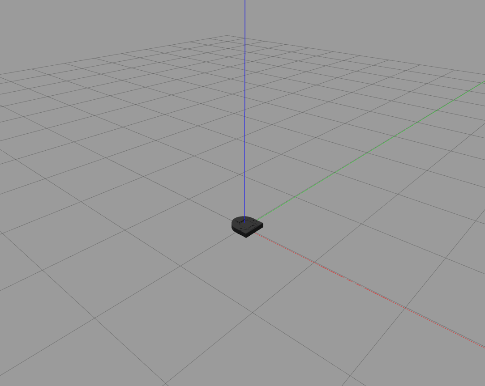
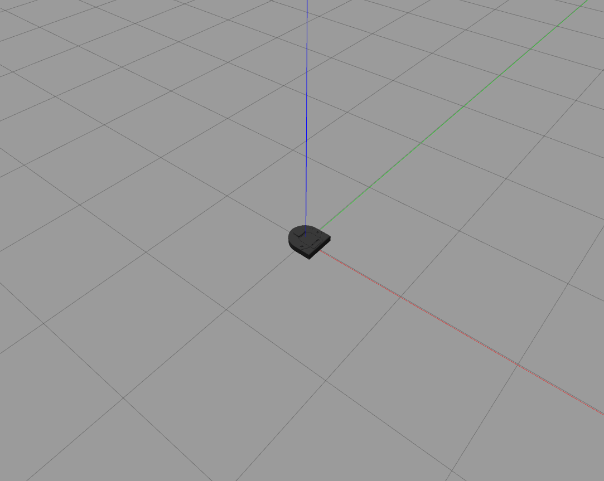
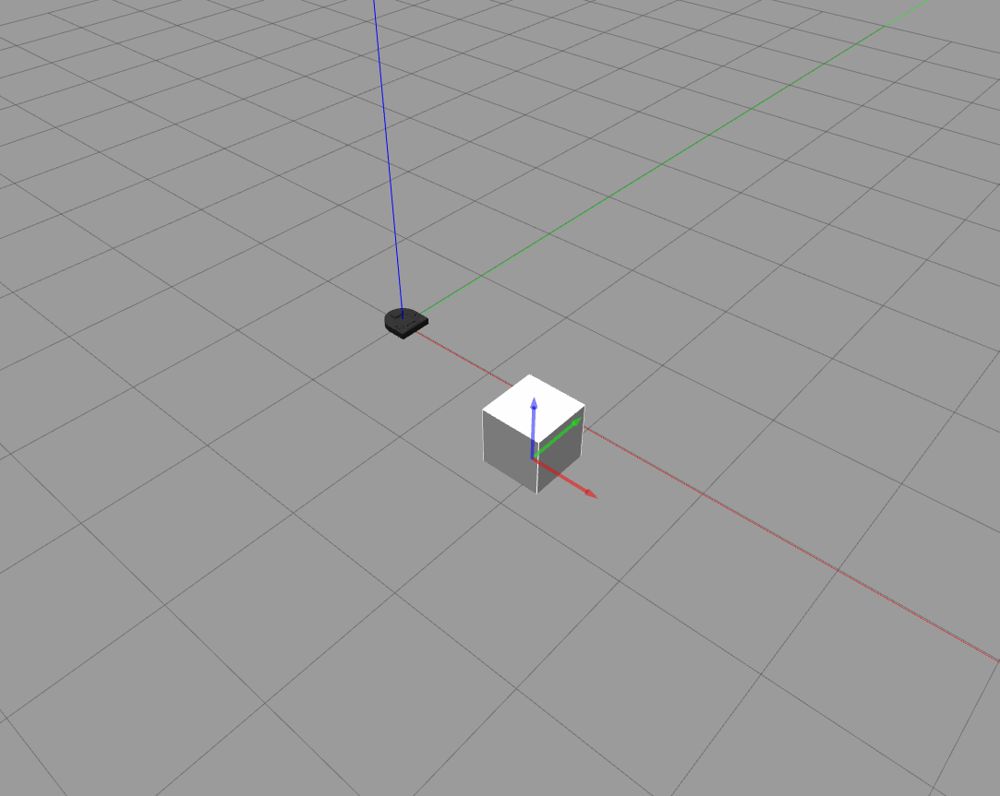
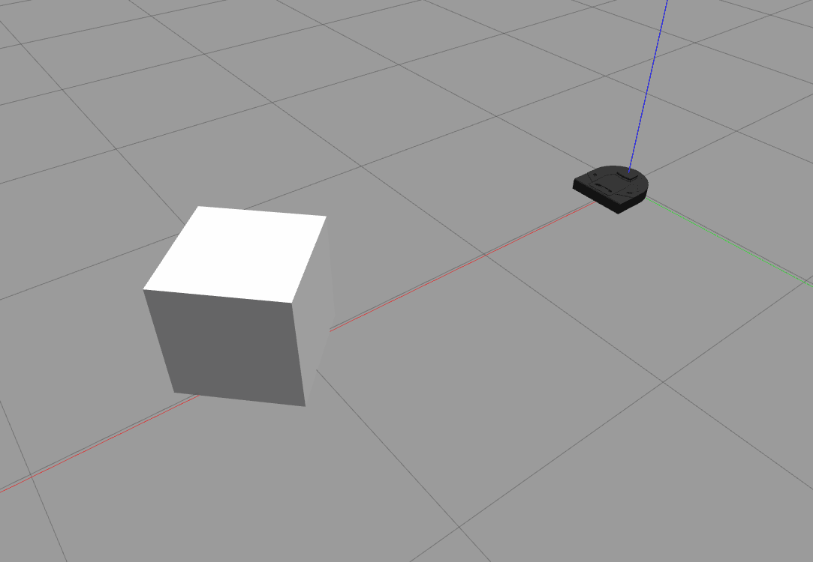
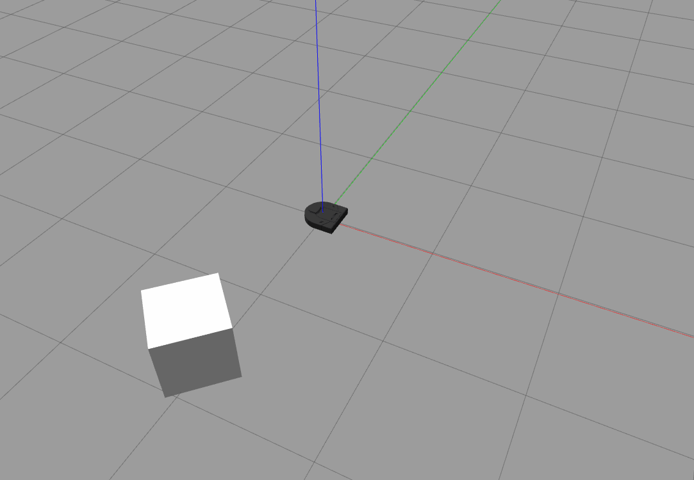

# CompRobo Warmup Project 2022

Explain what this project was, list contributors

# Teleop

## Approach

## Structure
structure - like ros topics, publishers, subscribers

## Limitation
what can be improved

# Drive Square

## Approach
how this is created, basic concept

## Structure
structure - like ros topics, publishers, subscribers

## Limitation
what can be improved

# Wall Follower

## Approach
how this is created, basic concept

## Structure
structure - like ros topics, publishers, subscribers

## Limitation
what can be improved

# Person Follower

## Approach
how this is created, basic concept

## Structure
structure - like ros topics, publishers, subscribers

## Limitation
what can be improved

# Obstacle Avoidance

## Approach
how this is created, basic concept

## Structure
structure - like ros topics, publishers, subscribers

## Limitation
what can be improved

# Finite State Control

## Approach
how this is created, basic concept

## Structure
structure - like ros topics, publishers, subscribers

## Limitation
what can be improved