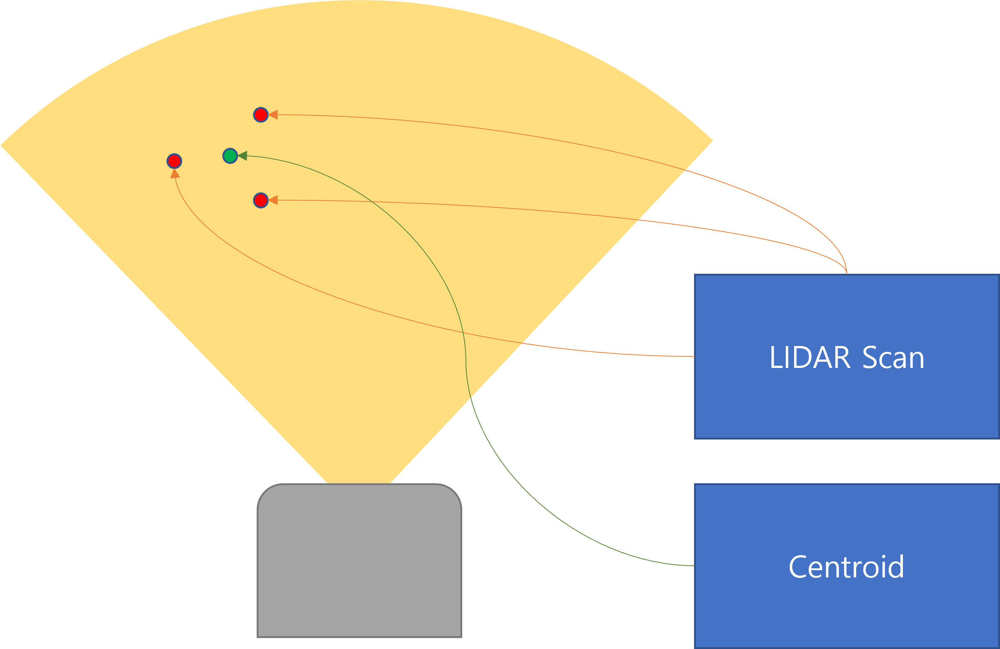
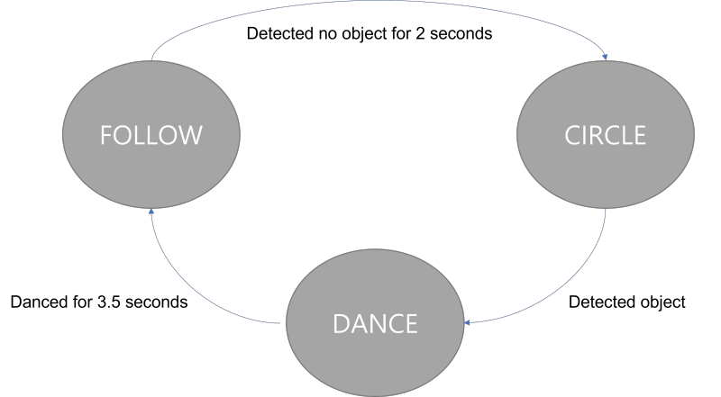

# CompRobo Warmup Project 2022

This Warmup Project involved programming the Neato to execute a variety of behaviors including: driving in a square, wall following, person following, obstacle avoiding, and exhibiting creative behavior based on finite-state machine of our design. From working on this project, the team was able to gain experience in using ROS and its visualization tools, testing with ROS, processing sensor data streams, understanding the gap between simulated versus physical Neato, etc.

# Teleop


## Approach
"Telop" allows the user to control the motion of the robot by with the keys WASD. The program reads in keyboard input and adjusts the linear speed and angular speed based on the following mapping:
- W : move straight forward
- S : move straight backwards
- A : turn left and move forwards slowly
- D : turn right and move forwards slowly

## Structure


Velocity data (Twist message) is published to /cmd_vel topic to change the robot's velocity.

## Limitation
Our current implementation allows for sufficient control of the robot using keyboard input. However, the linear and angular speeds are hard coded. Potential improvements include shifting from keyboard control to joystick control, where the speed of the robot can be an additional input, enabling more fine tuned control.

# Drive Square


## Approach
For "Driving Square", the project description proposed two approaches: 1) timing or 2) Neato's on-board odometry. For simplicity, we chose the first approach.
Drive square takes the most simple form of implementation: hard-coded values and a timer. The robot works by repeating the below behavior: 
- Move 1m with constant velocity for 2 seconds, 
- Wait for 1 second
- Rotate 90 degrees with constant velocity for 2 seconds
- Wait for 1 second

Repeating this behavior will eventually make the robot drive in a square. Velocity values were tweaked by going through simulation multiple times so that the amount of movement done is approximately 1m and rotation is 90 degrees. 

## Structure


Velocity data (Twist message) is published to /cmd_vel topic to change the robot's velocity.

## Limitation
Although our current implementation was easy to implement and is easy to understand how it works, the code is hard-coded. Since all the values are hardcoded, the code works best in the simulated environment where the ground is flat and there are no obstacles. Once the code is running in the real world, there was an issue with the robot not turning 90 degrees successfully or moving less than 1m based on the ground status and obstacles.

This can be improved a lot by subscribing to the /odom topic and getting to know the robot's position relative to its starting location. This will allow the robot to move at the exact distance and rotate at an exact angle. Also, the /bump topic can also be helpful to know if the robot is colliding with an obstacle and if there's a need to avoid it by taking a different path.

# Wall Follower


## Approach
For the wall following behavior, we wanted to have the robot be able to follow the wall on its right side. To do this, we first obtained the laser scan data at 45 and 135 degrees, which are angles 45 degrees from the robot's center on the right side. Refer to the following image for reference:


In order to move parallel to the wall, the laser scan distance detected at these two angles should be equal. We adjust which driection the robot should turn based on the difference between the two scan distances. 

- If distance at 45 degrees > distance at 135, turn left
- If distance at 135 degrees > distance at 45, turn right

## Structure


## Limitation
what can be improved

# Person Follower


## Approach
Person follower code was created mainly using neato's LIDAR scan data. To find an object in front of neato, we collected all scan data inside a circular sector in front of neato. Since there was scan data from all 360 degrees, we didn't have to just do the front but wanted to make it look like it is finding/following a person right in front of it. 



All the polar coordinate data from the scan was first converted to a cartesian coordinate. By adding up all the valid scan data and dividing it by the number of data we added, we were able to get the centroid, which will be the target destination for our robot. The destination was then converted back to polar coordinates so that it is easier for us to handle robot velocity. By moving and turning at a speed that is proportional to the distance and angle away from the destination, we were able to create a simple person-following robot.

## Structure


By subscribing to the /scan topic, it is possible to locate an object to follow. Once the destination is calculated, velocity data is published to the /cmd_vel topic to change the robot's velocity, and the /detected_object topic is published to create a marker in Rviz2 visualization.

## Limitation
Since the robot is locating a person by getting the centroid of the LIDAR measurement, there are multiple issues and limitations.

- It cannot distinguish between a person (moving object) from other objects (stationary). One approach to solve this problem is to wait for multiple LIDAR scans in duration and only follow the object that has moved more than a certain distance. 
- It cannot detect multiple objects at the same time, meaning that the target position might not be accurate once there are many objects. This can be avoided by getting a centroid for different objects (for example, define as a different object if the LIDAR scan returned 0 for a certain index) and looking for the closest object centroid as the destination.
- The robot will stay forever in one location until it finds an object to follow. To prevent this, simple behavior like rotating or moving around can be implemented to actively find a new target.

# Obstacle Avoidance


## Approach
how this is created, basic concept

## Structure


## Limitation
what can be improved

# Finite State Control


## Approach
The finite state control was meant to improve the person-follower code we created. To fix one of its issues the robot will stay without any action until it finds a target, a new behavior was implemented to actively look for a target if none is found.

Finite state control is defined by behavior (function) and state. The state is defined as an Enum Class which holds all the possible states for the robot. Each behavior is wrapped inside a function so that it can be distinguished from other behaviors. A loop was set to run every 0.1 seconds, and this will decide which action will be executed based on the current state:

```python
class State(Enum):
    FOLLOW = 1
    CIRCLE = 2
    DANCE = 3

def run_loop(self):
    # execute function dedicated to current state
    if self.state == State.FOLLOW:
        self.follow_person()
    elif self.state == State.DANCE:
        self.dance_with_joy()
    elif self.state == State.CIRCLE:
        self.circle_around()
```

Each state has a clear end condition, which will lead to the next state. The important thing was to not have a state that ends without transitioning to other states so that the robot can be active forever unless it is told to stop. 

## Structure



Possible STATEs:
- FOLLOW: The robot will behave the same as the person follower code, except for the fact that it now counts for the duration of time it was left without following a target. If the robot cannot detect any object for 2 seconds, the robot will change to the CIRCLE state. 
- CIRCLE: The robot will circle with constant linear and angular velocity, looking for a new target. If any target was detected by the robot's LIDAR scan, the robot will change to the DANCE state.
- DANCE: The robot will rotate with fast velocity, showing the joy of finding a new target. It will dance for a fixed duration of 3.5 seconds and will move on to the FOLLOW state.

## Limitation
There are several limitations to mention:

- The original plan was to implement a more complex finite state control where the robot actively looks for a new target with an algorithm. Due to time constraints, this was just replaced by a simple circling around motion. Also, there was a plan for better dancing but it was replaced by simple rapid rotation due to the same reason.
- The states connect, but it is currently just a linear transition, where FOLLOW will always change to CIRCLE, and CIRCLE will always change to DANCE. It will create a much more dynamic robot behavior if more states are introduced and if states have multiple next states. For example, CIRCLE can transition right away to FOLLOW, and only transition to DANCE if it took more than 10 seconds to find a new target.
- Because it used person follower code that had the limitations that we already mentioned above, it wasn't possible to run this code in the real-world robot. 

# Takeaways

- Getting familiar with ROS: 
- The communication pipeline (involving topics, subscribers, publishers) used in ROS 
